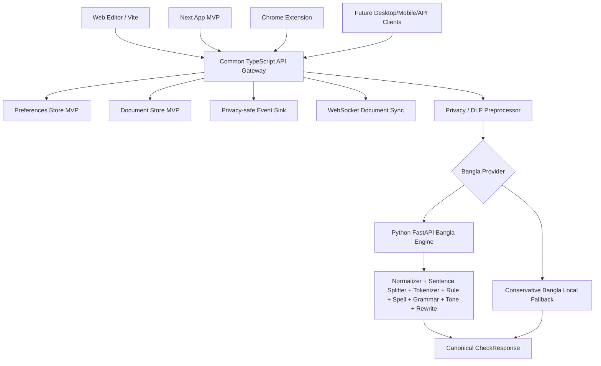
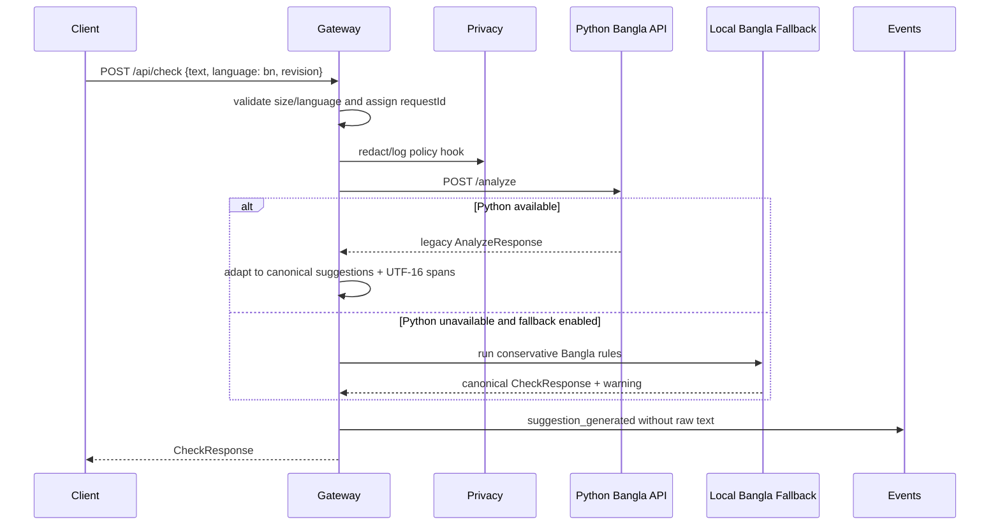
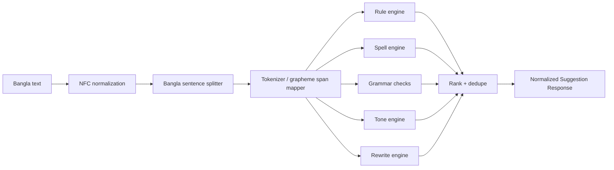
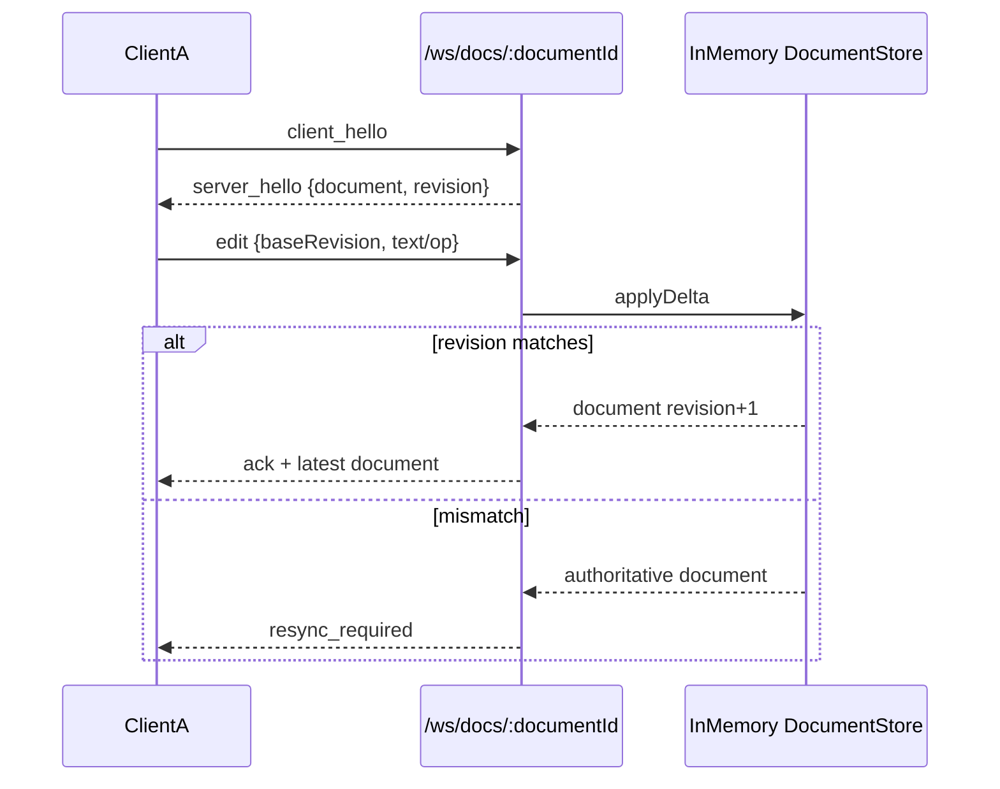
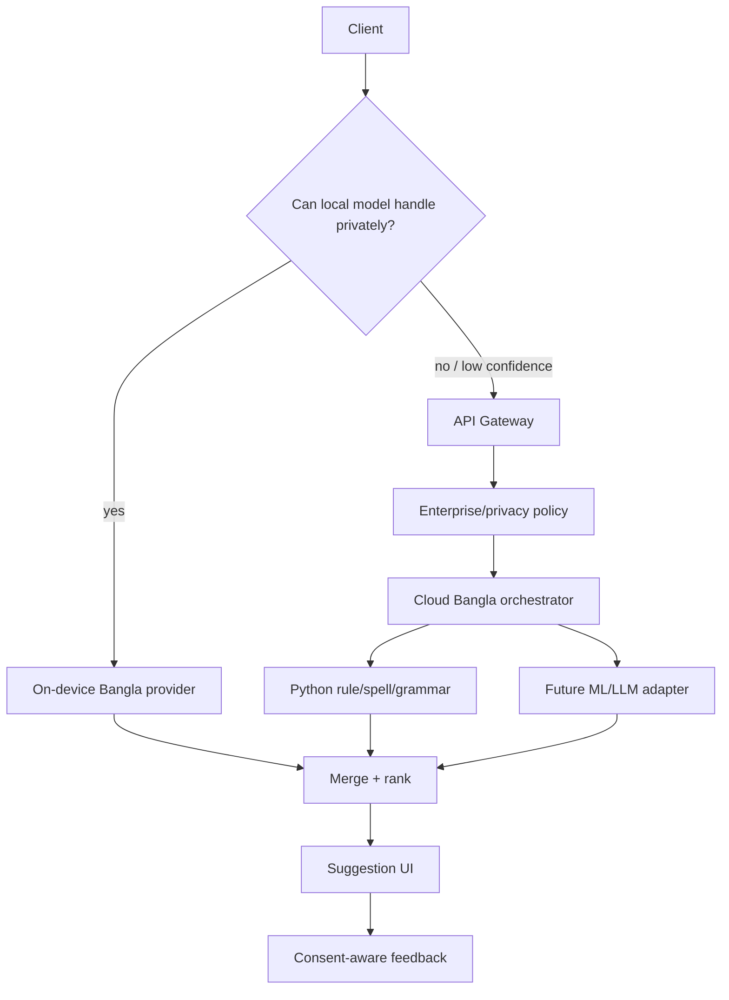

# Shuddho repaired architecture

Shuddho is an original Bangla writing assistant. The repaired architecture keeps the existing Python Bangla NLP app as the linguistic source of truth and makes the TypeScript API a common gateway for web, extension, and future clients.

## Current repaired architecture

## Check request flow

## Bangla NLP pipeline

## WebSocket document sync flow

The MVP sync protocol is intentionally not OT/CRDT; it is a server-authoritative revision skeleton that can evolve into full collaborative editing.

## Future hybrid on-device/cloud architecture

## Decisions

- Python Bangla engine remains the source of linguistic truth.
- TypeScript API is the common gateway and provider orchestrator.
- Frontends should call `/api/check` and receive canonical `CheckResponse`.
- Suggestion IDs and suppression keys are stable hashes, never request IDs.
- Python code point offsets are converted to browser UTF-16 offsets; grapheme snapping avoids splitting Bangla clusters.
- The Next MVP uses a textarea and side-panel cards instead of mutating `contentEditable` HTML every render.
- Events are privacy-safe and do not store raw full user text.
- Postgres and Redis are prepared for durable production mode; local dev can use memory mode.
