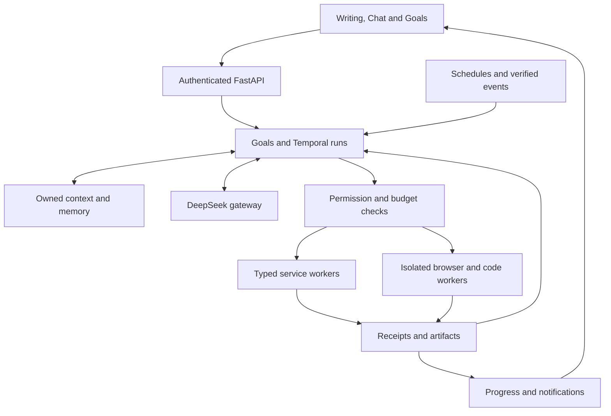

# Shuddho architecture

Shuddho is a multilingual writing platform with a bounded AI coworker foundation. The target is a personal AI agent that plans, executes, follows up, and produces verified results across personal and professional work.

**Status: proposed redesign, 26 September 2026.** Implementation baseline: `9c658742ac38c6a1f3bcaf7f6c92869be47ab4f2` (PR #204). This documentation creates no runtime capability, deployment, permission, activation, or live-provider evidence.

| Document | Purpose |
| --- | --- |
| [Personal agent architecture](PERSONAL_AGENT_ARCHITECTURE.md) | Components, execution, data, permissions, isolation and compatibility |
| [Service catalog](PERSONAL_AGENT_SERVICES.md) | All 16 requested categories plus Shuddho services and completion evidence |
| [Implementation plan](PERSONAL_AGENT_IMPLEMENTATION.md) | Engineering increments, acceptance scenarios, rollout and operating responsibilities |
| [Existing implementation history](IMPLEMENTATION_PLAN.md) | Writing/coworker and release-control increments |
| [Historical writing architecture](legacy/WRITING_ARCHITECTURE.md) | Preserved TypeScript-gateway-era design; historical context |

**The actual starting point is React/Vite, FastAPI and Temporal.** The active editor is `apps/web-editor`; the writing API is `services/api/shuddho_api`; coworker code is in `services/coworker`. Its repository capabilities include durable tasks/runs, typed tools, Temporal v1/v2, artifacts, bounded research, structured memory and approved actions. Repository presence is distinct from verified deployment.

Preserve free/local Bangla writing, the selected DeepSeek provider, backend-only secrets, explicit Gemma rollback, existing approval hashes/receipts and release evidence. Keep production features governed by their existing gates.

This shows execution relationships. All external paths, including search/inference, require the detailed design's data-release and egress checks; the diagram grants no unrestricted network access.

**The next code slice is persistent goals linked to existing runs.** Follow with schedules and durable notifications, then result-aware execution and consented connector reads. Browser, code and transactions have separate qualification gates. All services in the catalog remain in scope.

Existing [staging gates](PART_3_AGENT_EVAL_STAGING_GATES.md), [action policy](CONSEQUENTIAL_ACTION_POLICY.md), [release contract](../scripts/release_contract.py) and [model identity continuity](LIVE_MODEL_IDENTITY_CONTINUITY.md) remain authoritative for the implemented system.
