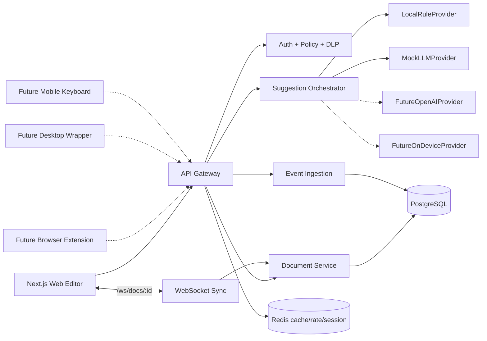
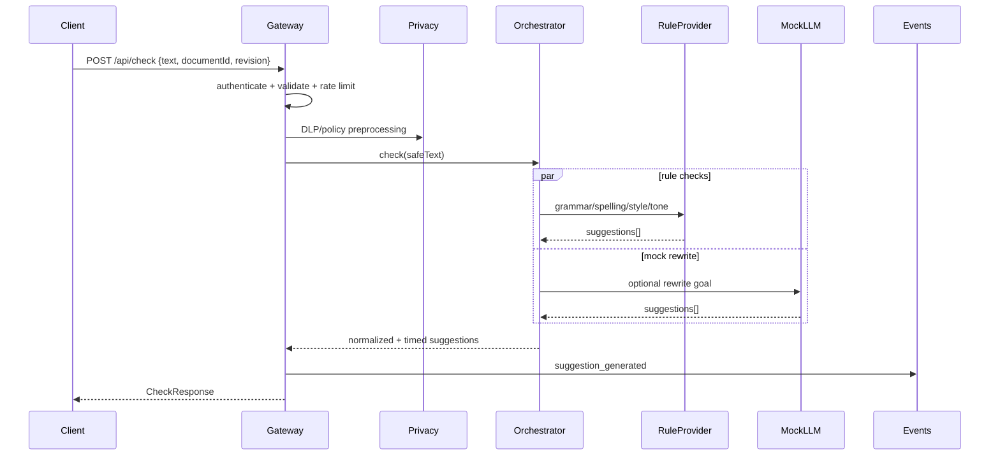
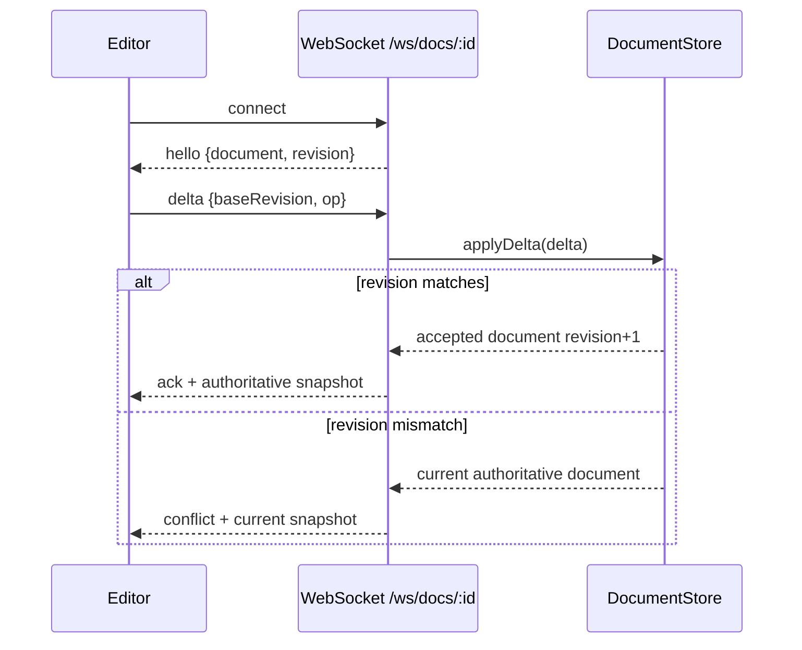
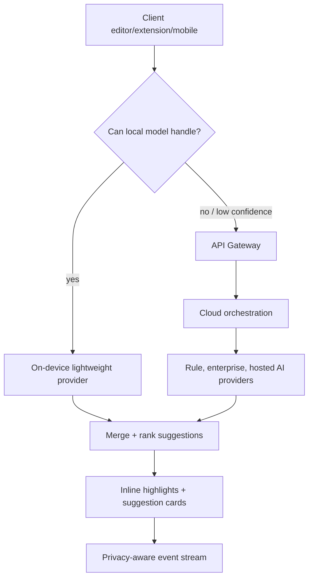

# Shuddho Draft Lab Architecture

Shuddho Draft Lab is an original AI writing assistant foundation that uses a hybrid client-edge-cloud architecture. The MVP ships a Next.js editor, an Express API gateway, a suggestion orchestration layer, rule-based NLP providers, mock LLM rewrite providers, WebSocket document sync scaffolding, PostgreSQL schema, Redis-ready cache boundaries, privacy hooks, and observability primitives.

## High-level system overview

## Client layer

The first client is `apps/web`, a Next.js application with a content-editable rich writing surface, local document state in Zustand, debounced suggestion requests, inline underlines, suggestion cards, and accept/reject flows. The client is intentionally API-driven so the same contracts can be reused by a browser extension, desktop wrapper, mobile keyboard, or on-device inference client.

## API gateway/common endpoint

`apps/api` exposes common entry points:

- `POST /api/check`
- `POST /api/rewrite`
- `POST /api/tone`
- `GET /api/preferences`
- `POST /api/events`
- `GET /health`
- `GET /metrics`
- `WebSocket /ws/docs/:documentId`

The gateway validates payloads with shared TypeScript validation helpers, attaches request IDs, routes text through privacy hooks, calls the suggestion orchestrator, and emits product events without logging raw full text. Rate limiting and stronger auth are represented as explicit production-readiness extension points.

## Suggestion orchestration

The `SuggestionOrchestrator` coordinates multiple providers through clean `SuggestionProvider` interfaces. Providers return normalized `Suggestion` objects with type, severity, original text, suggested text, span indexes, confidence, and source provider metadata.

## NLP/AI provider abstraction

Provider classes include:

- `LocalRuleProvider`: deterministic MVP checks such as `teh`, `recieve`, `I has`, repeated spaces, wordy phrases, passive voice hints, and harsh tone phrases.
- `MockLLMProvider`: no-cost rewrite adapter that simulates future model behavior.
- `FutureOpenAIProvider`: placeholder adapter for a hosted model provider.
- `FutureOnDeviceProvider`: placeholder for local lightweight inference.

The application does not depend directly on any single AI vendor.

## Document sync service

The document sync foundation defines a delta/edit operation format containing `documentId`, `baseRevision`, `clientOperationId`, and an operation. The in-memory `DocumentStore` applies server-authoritative revision checks, while the current WebSocket upgrade hook is a placeholder that marks the boundary for a full WebSocket transport. This is intentionally ready for operational transformation or CRDT integration later.

## Data storage

PostgreSQL is modeled with Prisma for users, documents, document revisions, suggestions, user preferences, product events, and team settings. Redis is reserved for suggestion caching, rate limiting, sessions, and ephemeral collaboration state. The MVP includes an in-memory fallback for local development and tests.

## Event pipeline

The event ingestion API accepts typed events for user typing, suggestions generated/accepted/rejected, rewrite requests, latency metrics, and errors. MVP storage can be PostgreSQL. The `EventSink` interface is designed so Kafka, Kinesis, or another streaming system can replace the simple sink without changing route handlers.

## Security/privacy controls

- Request IDs on every response.
- Auth middleware/bearer-token placeholder for production hardening.
- JSON body limits and rate-limiting extension point.
- Shared validation helpers and max text sizes.
- DLP preprocessing placeholder masks email addresses before provider calls.
- Consent fields for product improvement/training.
- Tenant/team policy placeholder in request context.
- Structured log redaction avoids raw text and sensitive headers.

## Observability

The API includes structured JSON logs, request latency timing, provider latency measurement, `/health`, `/metrics`, and error logging. Suggestion pipeline timings are returned in API responses for debugging and can later be exported to OpenTelemetry.

## Deployment model

Dockerfiles are provided for the frontend and backend. `infra/docker-compose.yml` starts Next.js, the TypeScript API, PostgreSQL, and Redis for local development.

## Future hybrid on-device/cloud inference flow

