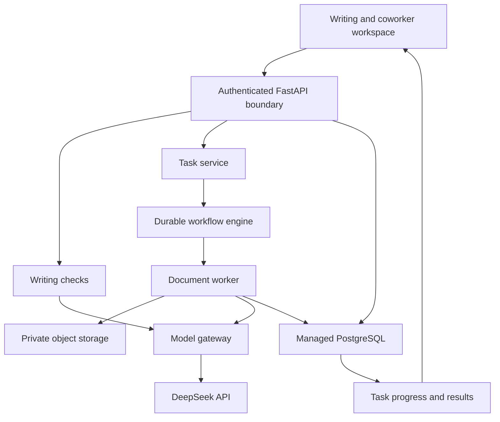

# Shuddho: three implementation parts

Working plan, 13 September 2026. Continue in the existing `rumman52/Shuddho` repository. Keep the writing editor useful throughout the transition.

## Decisions and implementation reality

| Kind | Statement |
| --- | --- |
| Product decision | One AI coworker for everyday and professional work across languages, documents, communication, and productivity. |
| Product decision | Preserve free writing assistance. Agent pricing and paid writing quotas are not decided here. |
| Model decision | DeepSeek is the selected API provider. The model ID remains configurable. |
| Technical direction | Qwen can later be a language specialist after deployment, evaluation, and cost/latency checks. It is not serving this branch. |
| Repository fact | The active editor is React/Vite in `apps/web-editor`; the writing service is FastAPI in `services/api/shuddho_api`. Legacy Node and Next applications also exist. |
| Repository fact | Feedback uses SQLite. AI caches and background reviews use process memory and threads. They are not durable workflows. |
| Assumption | Start with one operational region and managed infrastructure; select providers and residency from actual customer needs. |
| TODO | Measure language quality, peak demand, task cost, provider capacity, and regional latency. One billion people is a product ambition, not a demonstrated capacity. |

## The three parts

| Part | Outcome | Current status |
| --- | --- | --- |
| 1. Reliable writing foundation | Existing editor + configurable DeepSeek + correct suggestion application + clear failure states | Merged in PR #100; CI passed; live API and staging verification pending |
| 2. Coworker foundation | Authenticated workspace, durable tasks/files, and one useful document workflow | Merged in PR #101; CI passed; feature flags remain off pending the staging gates in the Part 2 report |
| 3. Full services and measured scale | Remaining skills, approved integrations, agent runtime, reliability operations, and regional expansion | Waves A/B/C and the first Wave D approved-action increment are merged through PR #109; Agent Runtime foundation is implemented in the next disabled-by-default increment; staging and later execution waves remain pending |

These are three release tracks with smaller steps, not a single rewrite or three enormous launches.

## Part 1 — reliable writing foundation

### Delivered scope

1. Preserve local Bangla rules, dictionaries, spelling, punctuation, and spacing checks.
2. Introduce DeepSeek through the existing provider boundary; keep explicit Gemma rollback.
3. Validate multilingual review JSON, exact text spans, and completion status. Preserve empty-string deletions.
4. Keep timeout and cancellation active until a JSON response body finishes. Bound the backend's DeepSeek body and overall call duration.
5. Show provider failures separately from a successful review with no suggestions.
6. Carry profile ID, document ID, revision, personal dictionary, and writing mode through the editor API.
7. Persist editor preferences per legacy profile and repair the feedback route mismatch.
8. Build corrected previews from validated suggestions. Applying an edit remains the user's action.
9. Repair the existing test collection and dependency lock, and add regression coverage.

See [Part 1 details](PART_1_WRITING_FOUNDATION.md) for exact files and release verification.

### Release gate

- Backend tests, editor tests, type checking, and builds pass.
- On staging, verify one successful paid DeepSeek call, one failure path, repeated suggestion applications, deletion, and stale response cancellation.
- Verify Bangla, English, a mixed-language example, and an RTL example in the actual browser; record limitations instead of claiming all languages are validated.
- Confirm secrets exist only on the backend and the configured provider is intentional.
- Do not expose the legacy profile/job API as the security boundary for a new public multi-user coworker.

## Part 2 — coworker foundation

See [the Part 2 implementation and deployment report](PART_2_COWORKER_FOUNDATION.md) for the implemented scope, exact modules, limits, account boundary and remaining release gates.

### First workflow

**“Turn this document or these notes into a professional report and an email draft in my chosen language.”**

The user provides notes or an allowed file, describes the outcome, and reviews the resulting report and email. The system asks a question only when missing information changes the result. A draft email is not a sent email.

### Architecture to implement

### Implementation order

1. **Authenticated account boundary.** Choose a managed identity provider; validate sessions on the server. Derive ownership from authentication, never a client `user_id`. Scope queries, files, tasks, events, preferences, and caches by account/workspace. Add ownership tests before exposing new endpoints.
2. **Durable data.** Add PostgreSQL migrations for workspaces, documents and versions, tasks and steps, artifacts, usage, and audit events. Migrate legitimate preferences after account association; do not automatically claim an anonymous profile belongs to a logged-in account. Store binaries in private object storage with short-lived authorized downloads.
3. **Durable workflow execution.** Use a managed workflow engine such as Temporal through one adapter. Compare hosting cost with the expected workload before provisioning. Persist task state independently of HTTP connections. Separate interactive writing capacity from file/agent workers. Recover after worker restarts and retry only retryable operations within a budget.
4. **File intake.** Start with TXT, DOCX, and text-based PDF, using explicit size/page limits. Detect file type, scan where available, and parse in restricted workers. Scanned PDFs require a separate OCR path; indicate this instead of pretending empty extraction is success. Treat file contents as data, not execution instructions.
5. **Deterministic workflow.** Extract → understand the request → draft report/email → validate → export. Use DeepSeek for the reasoning/writing steps that need a model, with bounded calls. A rule-based intent route is enough for the initial workflow; no open-ended planning loop is necessary.
6. **Document artifacts.** Create DOCX/PDF through document libraries and templates. Store output versions, source references, and task association. Report success only after an artifact exists, passes basic validation, and is accessible to its owner.
7. **Responsive task UI.** Return a task ID quickly; show queued/running/needs-input/completed/failed/cancelled status. Use SSE with a resumable event cursor and polling fallback. Persist tasks so refresh/reconnect does not restart work. Keep typing, local recovery, and the writing pane responsive while a task runs.
8. **Usage budgets.** Record tokens, latency, retries, and artifact cost per task. Enforce account budgets and concurrency before sending a paid request. Keep the free writing path available under a separate quota policy; this plan does not promise unlimited free inference.

### Proposed contracts — new, not existing routes

| Contract | Purpose |
| --- | --- |
| `POST /api/v1/tasks` | Authenticated task submission with instruction, output language, owned document IDs, and an idempotency key; returns 202 and task ID |
| `GET /api/v1/tasks/{id}` | Current owner-authorized status, progress, result artifacts, and failure information |
| `GET /api/v1/tasks/{id}/events` | Resumable progress events; no hidden chain of thought or credentials |
| `POST /api/v1/tasks/{id}/cancel` | Cooperative cancellation; stop new steps and make any completed work visible |
| Upload initialization/finalization | Enforce ownership and limits before an uploaded file can enter a workflow |
| Artifact download | Check ownership and return a short-lived download URL |

Each task carries account/workspace, task ID, workflow version, request ID, output language, input document versions, call/time budget, and result artifact IDs. Event sequencing and idempotency are server-enforced. An LLM response is never proof that an external action succeeded.

### Done when

- A real user can log in, submit a supported document, and download an editable report and email draft.
- Restarting a worker or refreshing the page preserves task progress and produces no duplicate artifact generation beyond the defined retry policy.
- Cross-account task, file, preference, and event reads are rejected.
- Empty files, unsupported scans, provider outages, quota exhaustion, and cancellation produce understandable terminal states.
- A curated multilingual evaluation records source fidelity, writing quality, formatting, task success, latency, and cost. No unmeasured universal language guarantee.

## Part 3 — remaining services and global operation

Wave A is implemented in [the Part 3 work-services report](PART_3_WORK_SERVICES.md). It adds seven services to the existing report-and-email workflow, with typed output and native downloads. Enable it only after the coordinated API/worker rollout and staging checks described there.

### Skill rollout

| Wave | Services | Implementation requirement |
| --- | --- | --- |
| A | Email drafts, social posts, careers/CVs, official documents, meeting agendas/minutes, daily/personal plans | Reuse the authenticated text/document workflow. Keep user facts and deadlines explicit; mark missing facts rather than inventing them. |
| B | Presentations, spreadsheets, broader file transformations | [Implemented scope and release gates](PART_3_PRESENTATIONS_SPREADSHEETS.md): existing durable workers create editable PPTX/XLSX, charts, notes and exports. Bounded CSV/XLSX/PPTX snapshots; native rendering and recalculation checks. |
| C | Web research, travel research, comparisons | [Implemented scope and gates](PART_3_RESEARCH.md): one explicit search, provider-retrieved page text, validated citation excerpts, source dates and cited native reports. Web content cannot authorize tools or account changes. |
| D | Calendar events, reminders, approved email sending, document sharing, approved social publishing | [First increment](PART_3_APPROVED_ACTIONS.md): Google email sending and single calendar events, encrypted OAuth connections, exact previews, explicit approval, durable execution, receipts and audit history. Reminders, sharing and social publishing remain later increments. Live provider validation is required before enabling. |

Reminders and calendar events require a persisted timezone-aware schedule. A generated checklist alone does not create a reminder. Reading transcripts does not imply audio transcription; add and evaluate that capability separately.

### Agent Runtime foundation

The first goal-driven runtime increment is documented in [the Agent Runtime foundation report](PART_3_AGENT_RUNTIME_FOUNDATION.md). It adds owned agent runs, steps, typed tool invocations, receipts, resumable events and a server-owned tool registry.

PR #111 adds the code-owned deterministic planner, crash-safe agent outbox and Temporal `AgentWorkflow`. PR #112 adds approval-aware Gmail/Calendar steps that pause and resume through the existing immutable action approval path. PR #113 adds [structured Agent Memory](PART_3_AGENT_MEMORY.md) with explicit user-owned facts, scoped runtime use, versioned provenance, expiry and hard deletion.

PR #114 adds [bounded intelligent planning](PART_3_INTELLIGENT_PLANNER.md): the model may select only server-provided non-consequential tool names; Shuddho reconstructs and validates executable arguments. Initial planner failures fall back to deterministic routing, and a run may automatically replan once only when an unstarted capability becomes unavailable.

PR #115 adds [typed Agent Step Handoffs](PART_3_AGENT_HANDOFFS.md). A later non-research task may consume a bounded live source derived from the nearest prior completed task in the same owner/run. Handoff text is not copied into Temporal history, task notes, tool arguments or durable receipts; only provenance is persisted.

PR #116 adds [bounded incomplete-result replanning](PART_3_OUTCOME_REPLAN.md). The existing structured `needs_input` state may trigger the run's single automatic replan for later unstarted steps only; completed work remains immutable and no draft content is exposed to the planner.

PR #117 adds [bounded multi-source handoffs](PART_3_MULTI_HANDOFFS.md): a later non-research task may consume up to two server-selected prior completed task results under one shared handoff byte budget.

PR #118 adds a [bounded dependency graph](PART_3_DEPENDENCY_GRAPH.md). Durable dependency metadata is derived by trusted server code after plan validation; model-selected step IDs and arbitrary DAG edges remain out of scope.

PR #121 adds [bounded parallel execution](PART_3_PARALLEL_EXECUTION.md): new runs may use the versioned `shuddho_agent_run_v2` path when both graph and parallel flags are enabled, with server-owned readiness, bounded fan-out/fan-in, serialized approved actions, deterministic failure behavior, and v1 fallback when the flag is off.

PR #123/#124 add [Agent Evaluation and Production Staging Gates](PART_3_AGENT_EVAL_STAGING_GATES.md): CI-safe routing evaluation, opt-in live planner evaluation, and an explicit machine-readable GO/NO-GO gate before enabling Coworker or Agent Runtime for production traffic.

PR #126 adds [live infrastructure probes](CONTROLLED_STAGING_LIVE_PROBES.md): non-destructive validation for managed identity JWKS, TLS PostgreSQL + migrations, private object storage round trips, Temporal namespace connectivity, and optional live DeepSeek planner evaluation.

The next staging increment adds the [authenticated API exercise](CONTROLLED_STAGING_API_EXERCISE.md): two-account owner-isolation checks across workspace/document/task/event/cancel boundaries plus an optional live artifact authorization/download path that can promote identity and storage evidence from partial to passed. Temporal restart/replay, backup/restore, deletion, provider actions and rollback remain separate gates. Subjective quality judging, model-selected external actions and multi-agent delegation remain later increments.

### Consequential actions

Bind approval to the exact recipients, content, attachments, account, destination, and time. If the payload changes, request fresh approval. Record an idempotency key before execution. On an uncertain network outcome, reconcile using the external provider's receipt/status before retrying. Display sent/published/scheduled only after a confirmed provider result.

Use one typed tool registry with per-tool authorization, argument schemas, allowed destinations, deadlines, and audit records. External documents, email threads, and search results never grant permissions. Avoid arbitrary shell or unrestricted browser execution in the product.

### Scale from observed demand

1. Cache and distribute static UI through a CDN. Keep editor work local where possible. This improves reach but does not eliminate cross-region model latency.
2. Run stateless API replicas and independent writing/agent worker pools. Scale workers from queue age and active task demand, with per-account fairness and backpressure.
3. Use database connection pooling, indexes based on real queries, object storage for large files, and lifecycle/deletion policies. Add a cache only for a demonstrated need. Private data keys must include ownership and version context.
4. Set separate latency/error objectives for local editing, quick checks, model review, task start, and artifact completion. Track p50/p95/p99 by region and language. A healthy HTTP endpoint does not prove a healthy model provider.
5. Load-test the application with a simulated model at realistic delays/errors, then run budgeted end-to-end capacity tests. Account for provider account-level capacity; new API keys do not create unlimited independent capacity.
6. Add regional cells only when demand, residency obligations, and operations justify them. Each cell owns its customers' primary data, queues, workers, and provider configuration. Route a workspace to its home region; avoid cross-region database calls on every edit.
7. Exercise backups, restores, worker loss, provider outages, overload shedding, key rotation, staged rollout, and rollback. Expansion requires an operational owner and measured reserve capacity.

### Capacity worksheet

Use measured inputs instead of sizing directly from “one billion users”:

- Peak writing requests/second = active sessions × checks per session/second.
- Approximate concurrent model calls = model requests/second × mean call duration in seconds, plus planned reserve. Bursts require separate testing.
- Agent worker demand depends on task mix, file sizes, number of model/tool calls, execution duration, and user concurrency.
- Total cost includes model tokens, retries, storage, database, workers, document rendering, search/OCR, and network transfer.

A billion registered accounts, a billion monthly users, and a billion simultaneous users require very different systems. No repository change can establish “zero lag” or a billion-user capacity claim; release targets must be measured and funded.

## Source notes

DeepSeek's current official examples use `deepseek-flash`; model selection remains environment-configurable because aliases can change. [DeepSeek API quick start](https://api-docs.deepseek.com/)

For writing review, JSON-object mode and explicit non-thinking mode are supported. JSON-mode responses may still be empty or truncated, which is why Part 1 validates completion and body content. [JSON output](https://api-docs.deepseek.com/guides/json_mode/), [thinking mode](https://api-docs.deepseek.com/guides/thinking_mode/)

Provider concurrency is a separate constraint from application replicas. Verify account limits before capacity planning. [DeepSeek rate limits and isolation](https://api-docs.deepseek.com/quick_start/rate_limit/)

The service boundaries, rollout sequence, and release gates above are Shuddho design choices. They do not imply that the planned infrastructure is already installed or provisioned.
