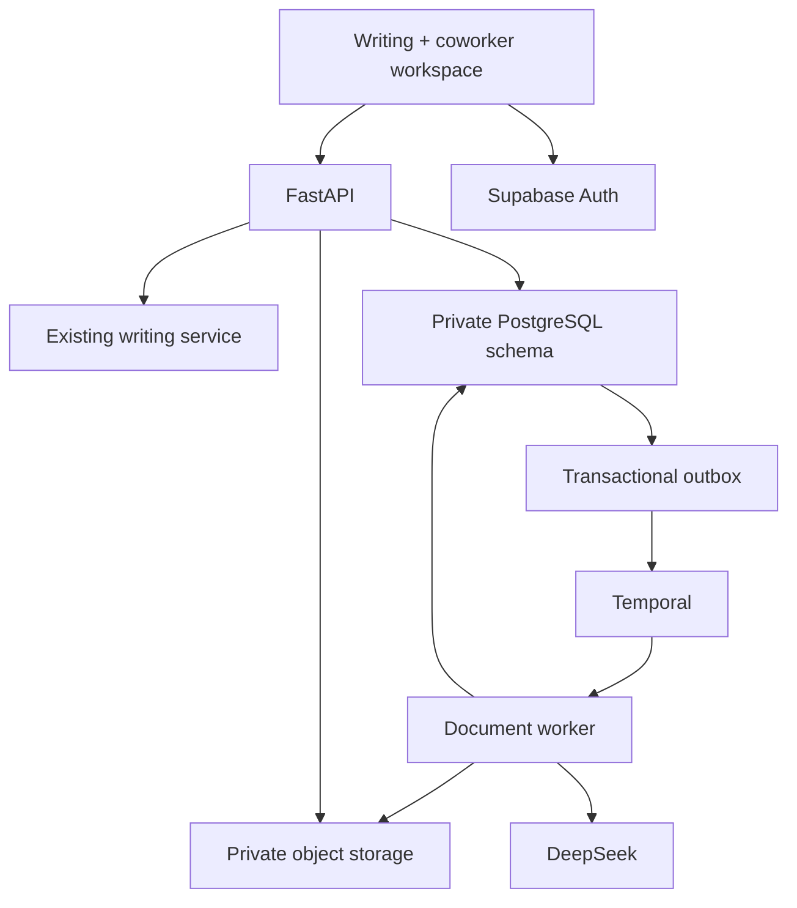

# Part 2 — the first Shuddho coworker workflow

Implementation branch: `codex/shuddho-part-2-coworker`. Builds on merged Part 1 PR #100. The feature is disabled by default; this document describes the code and the remaining staging release gates, not a live production deployment.

## What the user can do

Sign in, paste notes or upload TXT/DOCX/text-based PDF files, choose an output language, and request a professional report and email draft. A task survives page refresh and worker replacement. The user reviews the draft and downloads `report.docx`, `report.pdf`, `email-draft.txt`, and `source-manifest.json`.

Missing essential details produce a reviewable `needs_input` draft with placeholders. “Add details & revise” restores the original brief and owned input files into a new submission. No email is sent and no external account action is executed by this workflow.

The free writing assistant remains mounted beside the coworker tab. Existing spelling, grammar, DeepSeek review, and apply/dismiss behavior are preserved. The coworker bundle loads when opened. The legacy writing profile remains a separate anonymous profile: it is **not** an authenticated account, and its preferences are not silently imported. `/api/v1/preferences` is an owned account record; complete account synchronization of the old editor remains a separate migration.

## Implementation choices

| Component | Implementation | Reason |
| --- | --- | --- |
| Repository | Existing monorepo | Reuse the editor, API, provider transport and release process. |
| Identity | Supabase Auth in the browser; issuer-pinned JWT verification in FastAPI | Managed sign-in with server-derived ownership. |
| API | Optional `/api/v1` router | Keep account records independent of client-supplied legacy profile IDs. |
| Persistence | SQLAlchemy + Alembic + PostgreSQL | Transactional quotas, idempotency, task records and recovery checkpoints. |
| Files | Private S3-compatible storage | Binaries stay out of database rows and workflow history. |
| Execution | Temporal worker plus a database outbox | HTTP acceptance does not depend on a running worker; dispatcher delivery is recoverable. |
| Model | Configurable DeepSeek API model, non-thinking JSON output | One bounded drafting step with schema and provenance validation. |
| Export | `python-docx`, WeasyPrint, Noto fonts | Editable Word output and shaped multilingual PDF text. |
| Progress | Authenticated SSE with cursor, snapshot polling fallback | Short-lived connections can reconnect without resubmitting a task. |



The production API and worker are separate processes. Each worker currently allows four active activities. Workflows have four short steps and disable sticky workflow caching, making replay inexpensive and avoiding affinity to a departed worker. This setting is exercised by the restart test. A future change to workflow caching must repeat that test against the selected production Temporal version.

## Exact code map

| Path | Responsibility |
| --- | --- |
| `services/coworker/config.py`, `auth.py`, `container.py` | Configuration, signed identity verification, service construction. |
| `models.py`, `database.py`, `migrations/`, `migrate.py` | Accounts, one personal workspace per account, document versions, tasks, checkpoints, events, outbox, artifacts, usage and audit metadata. |
| `repository.py` | Owner-scoped reads, row-locked quota decisions, immutable input associations, idempotency and state transitions. |
| `api.py`, `schemas.py` | Account, file, task, progress and download contracts. |
| `runner.py`, `drafting.py` | Recoverable business steps and validated model output. |
| `worker.py`, `workflow.py` | Temporal activities, retries, dispatcher and shutdown. |
| `extraction.py`, `parse_worker.py` | Bounded text extraction in a child process. |
| `exports.py`, `render_worker.py`, `storage.py` | Resource-limited exports, digest verification and private downloads. |
| `apps/web-editor/src/WorkspaceShell.tsx` | Persistent writing/coworker navigation. |
| `apps/web-editor/src/coworker/` | Sign-in, task composer, uploads, history, progress, previews and downloads. |
| `Dockerfile.coworker`, `infra/compose.coworker.yml` | Optional runtime image and local development services. |

## API contracts

All `/api/v1` routes require a Bearer access token. Ownership comes from verified issuer + subject; callers cannot supply an account owner. Different owners receive 404 for inaccessible resources.

| Method and route | Input / result |
| --- | --- |
| `GET /api/v1/me` | Account workspace, preferences and current limits/usage. |
| `PUT /api/v1/preferences` | Validated dictionary, writing goal, tone and language preferences. |
| `POST /api/v1/documents` | Filename, byte size, SHA-256; reserves upload storage and returns document/version IDs. |
| `PUT /api/v1/documents/{id}/content` | Raw bytes, checked against the reservation and file signature. |
| `GET /api/v1/documents` | Up to 100 owned uploads. |
| `DELETE /api/v1/documents/{id}` | Removes an unused source from the workspace; physical cleanup follows. Active task sources cannot be deleted. Existing task drafts remain. |
| `POST /api/v1/tasks` | Instruction, notes, owned document IDs and language. Requires `Idempotency-Key`; returns 202. |
| `GET /api/v1/tasks` | Latest 30 owned tasks. |
| `GET /api/v1/tasks/{id}` | Status, original input, draft, artifact metadata and accounted usage. |
| `GET /api/v1/tasks/{id}/events?after=3&stream=true` | SSE progress with event IDs; `Last-Event-ID` also supported. Without `stream=true`, returns JSON events. |
| `POST /api/v1/tasks/{id}/cancel` | Idempotent cooperative cancellation. |
| `GET /api/v1/artifacts/{id}/download` | Authorized S3 URL lasting 60 seconds, or a local development content route. |
| `GET /api/v1/artifacts/{id}/content` | Authorized, digest-checked download. |

Example submission:

```json
{
  "instruction": "Prepare a project report and a short email for my team.",
  "notes": "The team completed 12 reviews on 10 September 2026.",
  "document_ids": [],
  "output_language": "bn"
}
```

Reusing an idempotency key with unchanged input returns the original task. Changing the input under the same key returns 409. Events report useful progress only; they contain no source text, model reasoning, credentials or provider response bodies.

## Reliability and boundaries

Task insertion, quota accounting, first event and outbox insertion share one database transaction. The dispatcher uses a stable Temporal workflow ID and rejects duplicate starts. Worker activities save extraction, draft and export checkpoints in PostgreSQL. The final artifacts are linked only after stored bytes pass SHA-256 checks. A crash before a checkpoint can repeat that phase; already saved drafting checkpoints avoid a new model call.

Temporal activities run at least once. DeepSeek calls do not have an application-controlled exactly-once guarantee: a lost connection after provider acceptance can still consume tokens. Reservations remain fully accounted when usage is unknown. A task permits at most two model attempts, and both account and task budgets must allow another call. Completed responses replace the reservation with reported token usage. These are token controls, not dollar pricing or billing.

The user can cancel queued or running work. The active activity checks cancellation while waiting; a model request already accepted by DeepSeek may still be billed. Parsing and rendering children have their own time/memory limits. They receive no database, storage or provider secrets and do not intentionally fetch external resources. They are resource-limited processes, **not** a full operating-system network sandbox or malware scanner.

| Initial limit | Value |
| --- | --- |
| Input files | Up to 5; 8 MiB each; TXT, DOCX or text-based PDF |
| PDF pages | 40 |
| Combined readable source | 20,000 characters |
| Visible stored source files | 100 per workspace |
| Account file budget | 256 MiB by default |
| Daily tasks / active tasks | 20 / 2 by default |
| Daily tokens / task tokens | 500,000 / 100,000 by default |
| Model attempts | At most 2 |
| Model response deadline | 90 seconds |
| Task deadline | 20 minutes |
| SSE connection | Up to 20 seconds, bounded by token expiry |

API reads and the dispatcher expire overdue tasks. Abandoned uploads and user-deleted sources are cleaned after their deadline plus a short grace period; this also releases reserved source storage. Worker loss during an output write can leave an unreferenced object. Before a public release, run an inventory-based orphan cleanup against database artifact/checkpoint references and set the chosen bucket's retention/versioning policy. Do not apply a blanket lifecycle expiration to committed report objects without updating their database records.

Finished or failed tasks discard the extraction checkpoint's full-text copy. Original pasted notes, generated drafts, provenance, and task history remain available to their owner. Deleting a source upload does not erase those prior drafts; complete account/task erasure and retention operations are a public-release gate.

JWT verification accepts issuer-pinned RS256/ES256 keys and checks expiry, audience, issuer and authenticated role. HS256/shared-secret projects must migrate to supported asymmetric signing keys. JWT sign-out/revocation is not instantaneous backend revocation: an already issued valid token remains usable until expiry. Set an appropriate access-token lifetime and document the revocation policy. Private account tables live in `shuddho_coworker`, outside Supabase's default public Data API schema; do not expose that schema or grant it to browser roles.

## Run locally

Copy `.env.coworker.example` to `.env.coworker`, set the real Supabase issuer and DeepSeek key, and keep that file out of git. The Compose profile supplies development database/storage/Temporal settings itself. It binds service ports to localhost; its development passwords and Temporal server are not production services.

```bash
docker compose -f infra/compose.coworker.yml up --build
```

Configure `apps/web-editor/.env.local` with these **public** browser settings:

```dotenv
VITE_COWORKER_ENABLED=true
VITE_SUPABASE_URL=https://YOUR_PROJECT.supabase.co
VITE_SUPABASE_PUBLISHABLE_KEY=YOUR_PUBLISHABLE_KEY
VITE_COWORKER_API_BASE_URL=http://127.0.0.1:8000
```

In Supabase, enable email sign-in, configure confirmation/reset redirect URLs for the local and deployed frontend, and configure asymmetric JWT signing. Then:

```bash
npm ci
npm run dev --workspace @shuddho/web-editor
```

Alternatively, run native processes with Python 3.11+ and the documented WeasyPrint/Pango/font dependencies:

```bash
uv sync --frozen --group dev --extra coworker
uv run --env-file .env.coworker --extra coworker python -m services.coworker.migrate
uv run --env-file .env.coworker --extra coworker uvicorn services.api.shuddho_api.app:app --port 8000
```

In a separate terminal:

```bash
uv run --env-file .env.coworker --extra coworker python -m services.coworker.worker
```

For native local services set `SHUDDHO_COWORKER_ENABLED=true`, development mode, a local PostgreSQL URL, `SHUDDHO_COWORKER_STORAGE=local`, and local Temporal settings in `.env.coworker`. The API does not apply migrations automatically.

## Production staging and rollback

1. Provision the chosen managed identity, PostgreSQL, private object bucket and Temporal namespace. Record region, retention, backup and cost decisions. Keep browser roles out of the private schema. Use a migration role separately from the runtime database role where practical; grant the runtime role only the private schema/table access it needs.
2. Build `Dockerfile.coworker`. Supply backend-only environment variables to both API and worker as appropriate. Use TLS for database, storage and Temporal. Use a private bucket with public access blocked and least-privilege object access. Give workers enough memory for their configured activity concurrency and child limits; size this from measured documents.
3. Run migrations once before enabling routes. Start the document worker. Verify task submission/outbox delivery, source upload, model completion and all four downloads in staging.
4. Add the public frontend Auth configuration and trusted API origin. For the existing Vercel app, `/backend` remains the same-origin proxy. Enable `VITE_COWORKER_ENABLED` only for the intended deployment. Check allowed origins and email redirect allowlists.
5. Complete live identity/key rotation, private S3 signed download, paid DeepSeek, browser refresh/cancel and worker replacement checks. Verify Bangla and RTL fonts in the actual image. Review all output facts; the test model is not evidence of DeepSeek's language quality.
6. Before opening signup broadly, add deployment ingress limits, provider spend alerts, orphan cleanup, retention/deletion operations, DB backup/restore verification and queue-age alerts. Limit the initial cohort and measure latency, errors, document quality and cost.

Rollback the frontend flag to hide the coworker entry. Stop new coworker submissions by disabling the backend feature after deciding whether active tasks should drain or be cancelled. Keep the worker and migrations available while tasks drain. The original lightweight Dockerfile and Part 1 writing routes remain available; do not run a destructive schema downgrade to hide the UI.

## Verification

```bash
uv run --extra coworker pytest -q
SHUDDHO_TEMPORAL_TESTS=true uv run --extra coworker pytest tests/test_coworker_temporal.py -q
npm test
npm run build
```

`tests/test_coworker_postgres.py` runs against a dedicated database from `SHUDDHO_TEST_POSTGRES_URL` and exercises concurrent submission, active-task limits and token settlement. Never point that test variable at customer data. The coworker CI job runs PostgreSQL and Temporal checks plus a browser fixture with real JWT verification, task persistence and exports. Its identity responses and model outputs are explicitly simulated; no real email is sent or API inference purchased by CI.

The browser check covers sign-in, file upload, submission, navigation back to writing, refresh recovery, Bangla output, DOCX download, narrow viewport layout, sign-out and account switching. Screenshots are CI artifacts. Local browser verification may depend on whether the environment can download the browser runtime.

Live provider quality, managed-service credentials, production image startup, private S3 integration and staging rollout are separate release gates. This implementation does not establish universal language quality, zero latency or billion-user capacity. Part 3 adds the remaining skills and measured operations incrementally.

## Primary references

This implementation uses server-validated identity following [Supabase JWT documentation](https://supabase.com/docs/guides/auth/jwts). Its database outbox, task boundaries and limits are Shuddho implementation choices.

The recovery and retry design accounts for [Temporal's activity delivery and error handling](https://docs.temporal.io/develop/python/best-practices/error-handling). The local Compose service follows the [Temporal CLI development setup](https://docs.temporal.io/cli/setup-cli); that development server is not a production deployment.

The image includes the text shaping and font dependencies described by [WeasyPrint's installation guide](https://doc.courtbouillon.org/weasyprint/stable/first_steps.html). Model configuration follows the [DeepSeek JSON output contract](https://api-docs.deepseek.com/guides/json_mode/); JSON mode still requires application validation.
