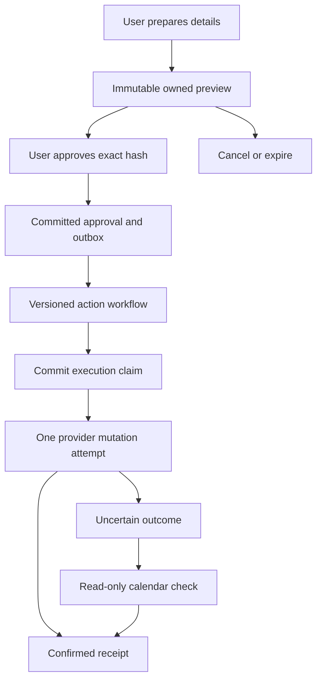

# Part 3, wave D: approved email and calendar actions

This increment lets a signed-in user connect Google, prepare an exact email or calendar event, approve it, and see a recorded provider result. DeepSeek remains the drafting model. The free writing assistant and existing document workflows remain intact. Actions are disabled by default; implementation and simulated-provider tests do not establish a live Google rollout.

## User-facing scope

| Action | Included | Boundaries |
| --- | --- | --- |
| Email | Gmail/Google Workspace account, To/Cc/Bcc, multilingual subject and plain-text body, immediate sending after approval | Up to 20 distinct recipients; no attachments, sender aliases, mailbox reading, thread replies, or scheduled sends |
| Calendar | One future event in the connected account's primary calendar, title/description/location, IANA time zone, start/end and optional guests | Up to 20 guests; invitations to all listed guests; guests see each other; no recurrence, reminders, all-day events, video-link creation, updates or deletions |

The existing email draft includes **Prepare this email for sending**. Only subject and body are copied; the user supplies full addresses. In **Email & calendar**, the user connects each capability separately, fills the form, and selects **Review action**. The server returns the immutable preview. Editing cancels that preview and requires a fresh one. The final button explicitly says **Approve & send email** or **Approve & create event** and requires checking the review acknowledgement.

The UI supports Unicode content and `dir=auto`; email addresses in this first connector use bare ASCII mailbox syntax (international domains can use punycode). It does not resolve a contact name to a guessed recipient. Local calendar inputs are converted on the server using the specified IANA zone. The preview shows the resolved UTC offset. Daylight-saving gaps and ambiguous local times are rejected; API callers can disambiguate with an explicit matching offset. Event duration is bounded to seven days and the start to the next year.

## Execution and recovery

Actions use new tables rather than changing completed draft tasks. `cw_external_actions` stores the owner, connection ID, canonical input fingerprint, preview, preview hash, timestamps, status, outbox lease, and receipt. `cw_connections` stores immutable account identities and encrypted refresh tokens. `cw_oauth_attempts` stores hashed, expiring single-use state and an encrypted PKCE verifier. Existing `cw_audit_events` records preparation, approval, execution and outcomes without bodies/tokens in its event names.

The approval covers provider, exact connection/account identity, recipients, content, attachment policy, destination, timing, invitations, reminders and expiry. The API accepts only the preview hash at approval; it has no edit-after-approval route. A reused submission key with identical input returns the same action, and a changed input conflicts. Approval replay returns the existing result. PostgreSQL account and row locks serialize quotas and execution claims.

Preview validity is 15 minutes. Approval permits execution for at most five further minutes, bounded by the original expiry. The worker checks expiry and current connection before claiming. A transaction records `executing` **before** a provider mutation. No recovery path clears that claim. Cancellation/disconnect can stop unclaimed actions; once claimed, the UI never promises cancellation or that nothing was sent.

The separate Temporal identity is `shuddho_approved_action_v1`, with workflow IDs `shuddho-action-<UUID>`. It carries IDs only, uses the existing worker queue/concurrency cap, and retries the business activity up to three times. Retry after a committed claim reconciles; it never issues a second mutation. A ten-minute abandoned claim becomes `outcome_unknown` via dispatcher maintenance. A late confirmed result can resolve uncertainty and cannot be overwritten by a later unknown result.

This is a conservative one-attempt design, **not an exactly-once delivery guarantee**. A crash between claim and HTTP request may leave an action uncertain even if nothing was sent. Gmail sending has no documented application idempotency parameter. With send-only permission, Shuddho cannot inspect the mailbox to reconcile a lost receipt; it tells the user to check Sent before preparing another email. A Gmail receipt confirms provider acceptance, not delivery or reading. [Gmail send API](https://developers.google.com/workspace/gmail/api/reference/rest/v1/users.messages/send)

Calendar inserts use a stable UUID-derived event ID and private action/hash markers. Reconciliation uses `events.get` for that ID and checks the markers, title, content, attendees and instants. A missing, deleted or changed event remains uncertain and never triggers another insert. The user can explicitly **Check calendar result**. A confirmed event does not confirm guest attendance. [Calendar event insertion](https://developers.google.com/workspace/calendar/api/v3/reference/events/insert)

There are two code-owned tool schemas (`email_send`, `calendar_create`). Both are registered through the [connector-neutral consequential-action policy](CONSEQUENTIAL_ACTION_POLICY.md). Every preview includes a server-owned approval-scope manifest binding provider, exact connection/account identity, payload SHA-256, recipients/destinations, policy and expiry. Approval and execution revalidate that scope. Neither model output, source text nor search results can approve actions or select arbitrary endpoints. The provider only calls fixed Google HTTPS endpoints; redirects and environment proxy discovery are disabled. Every HTTP request has a 20-second overall bound and a 256 KiB decoded response limit. Provider bodies and credentials are excluded from API errors and Temporal failures. Calendar description markup is escaped so its literal text matches the approval preview.

## OAuth and credentials

Google is the first connector adapter, not a change to the LLM provider. Each capability requests `openid email` plus one scope:

| Capability | Scope |
| --- | --- |
| Email | `https://www.googleapis.com/auth/gmail.send` |
| Calendar | `https://www.googleapis.com/auth/calendar.events.owned` |

No Gmail read permission is requested. The calendar scope is broader than this product's primary-calendar-only action; review the Google consent screen and required app verification before launch. [Gmail scope classification](https://developers.google.com/workspace/gmail/api/auth/scopes), [Calendar authorization](https://developers.google.com/workspace/calendar/api/auth)

OAuth uses authorization code exchange with PKCE S256, random state bound to the signed-in Shuddho owner, a ten-minute expiry and single use. Browser session storage also binds the callback to its initiating tab/account. Google returns to the fixed **frontend** `/oauth/google/callback` path; the module removes code/state from the URL before Supabase can process them. The authenticated API exchanges the code. It checks granted scope and obtains verified Google identity through the fixed userinfo endpoint; it does not trust identity supplied by the frontend. A callback consumed during an interrupted exchange must be started again. [Google OAuth web-server flow](https://developers.google.com/identity/protocols/oauth2/web-server), [Google identity endpoints](https://developers.google.com/identity/openid-connect/openid-connect)

Refresh tokens and temporary verifiers use AES-256-GCM with random nonces and owner/row-bound associated data. Only the backend has the key. Access tokens exist only during a backend operation. Refresh rechecks the connected Google subject and email before execution. Reconnecting creates a new connection ID and cancels unclaimed actions on the old capability, so old approvals cannot move to a different account.

**Disconnect** erases Shuddho's stored credential and cancels pending actions. It does not revoke Google's entire app grant, which may also cover another connected capability. The UI links to Google Account permissions for that wider revocation and explains this distinction. A previously claimed action may still finish. Do not describe local disconnect as provider-wide token revocation.

Default limits: 20 approved actions per account/day across both capabilities, 100 previews/day and 20 OAuth starts/day. Approved but cancelled/expired attempts still count. Manual calendar reconciliation allows ten checks per action, spaced at least one minute apart. Apply deployment-level request limits, as with other authenticated workspace APIs.

## Configuration and staged release

1. Complete the existing [Part 2 staging gates](PART_2_COWORKER_FOUNDATION.md#production-staging-and-rollback). Use PostgreSQL, private object storage, real managed identity and a running Temporal worker. SQLite is for development/tests only.
2. Create a Google Cloud **Web application** OAuth client; enable Gmail API and Calendar API. Configure consent, authorized domains, privacy/deletion policy, and test users or required verification. Register exactly `https://YOUR-FRONTEND-DOMAIN/oauth/google/callback`. Do not use the backend URL. Keep callback query strings out of CDN/proxy/analytics logs; the frontend sends no referrer.
3. Set backend secrets on the API and every worker: `SHUDDHO_GOOGLE_CLIENT_ID`, `SHUDDHO_GOOGLE_CLIENT_SECRET`, `SHUDDHO_GOOGLE_REDIRECT_URI`, and `SHUDDHO_CONNECTOR_ENCRYPTION_KEY`. The encryption key is base64-encoded **32 random bytes** generated in a secure local environment and stored in the secret manager. Never use the public test fixture key. Back up the key separately from the database. Do not put these variables in Vite configuration.
4. With `SHUDDHO_ACTIONS_ENABLED=false`, run `python -m services.coworker.migrate` to apply migration `0002`, then update all API and worker/dispatcher instances. Old workflow identities remain registered. Retire old workers before enabling this flag; this rollout uses coordinated registration, not Temporal worker deployment versioning.
5. In staging, set `SHUDDHO_ACTIONS_ENABLED=true`, and optionally `SHUDDHO_COWORKER_DAILY_ACTIONS`. The existing coworker/API/frontend flags must also be enabled. Production configuration requires an HTTPS callback at the exact path; loopback HTTP is allowed only in development.
6. With explicitly authorized test accounts/recipients, verify real Google consent (including denied/partial consent), callback, refresh, account identity, Unicode email/Bcc, primary-calendar time zone and invitations, receipt fields, disconnected/revoked access, expired approval, worker loss and uncertain results. Check that a timeout cannot cause a second send. Record evidence before admitting users.
7. Measure queue age, provider failures, uncertain-result count, latency and account limits. Treat retention/deletion, backups/restoration, incident response and key rotation as release gates; this increment does not complete Part 2's broader operations work.

Disable new actions by setting `SHUDDHO_ACTIONS_ENABLED=false` on **API and all workers**. Restart with the current code. Already issued HTTP requests cannot be recalled. Saved histories, cancellation and local disconnect stay available. Queued approvals expire; keep new worker code and migration tables for existing histories. Do not downgrade/drop these tables as a routine rollback.

For emergency key loss/rotation before a re-encryption migration exists: disable actions, preserve the old key for any authorized recovery, disconnect affected accounts, install a new key consistently, and require reconnecting. Do not silently replace the key while expecting old encrypted credentials to work. No raw-token export endpoint exists.

## API and implementation map

All routes require a current Shuddho bearer token and owner checks. OAuth redirects themselves return to the frontend, not a cookie-authorized backend mutation.

| Route | Purpose |
| --- | --- |
| `GET /api/v1/connections` | Capability availability and owned active connections |
| `POST /api/v1/connections/google/start` | Start a selected capability's OAuth flow |
| `POST /api/v1/connections/google/finish` | Consume state/code and store the verified connection |
| `DELETE /api/v1/connections/{id}` | Disconnect locally and cancel pending actions |
| `POST /api/v1/actions` | Prepare immutable preview; requires `Idempotency-Key` |
| `GET /api/v1/actions` | Latest 50 owned previews/results |
| `GET /api/v1/actions/{id}` | Full preview, status, receipt and audit history |
| `POST /api/v1/actions/{id}/approve` | Approve with `preview_hash` only |
| `POST /api/v1/actions/{id}/cancel` | Cancel an unclaimed action |
| `POST /api/v1/actions/{id}/reconcile` | Read-only check of an uncertain calendar result |

Backend: `action_schemas.py`, `action_security.py`, `action_repository.py`, `google_actions.py`, `actions.py`, plus existing API/container/config/models/worker/workflow files and migration `0002`. Frontend: `ActionWorkspace.tsx`, `googleCallback.ts`, the existing client/workspace/shell and shared styles.

Tests cover authenticated isolation, encryption binding, OAuth state/PKCE/partial consent, injection rejection, DST/offset handling, hash mismatch, idempotency, quotas, cancellation/disconnect races, provider rejection, uncertain replies, stable calendar receipts, PostgreSQL concurrent claims and Temporal restart recovery. The browser suite exercises simulated Google consent, multilingual previews, editing, explicit approval, refresh/history, email/calendar receipts, uncertain email status, disconnect, mobile layout and account switching. Simulated transport fixtures are excluded from the deployed image.

The backend now includes a disabled-by-default [Microsoft Graph email/calendar adapter](MICROSOFT_GRAPH_ACTIONS.md) behind the same consequential-action registry. It is not exposed in the production UI or approved for live rollout by this increment.

A later bounded Agent increment adds [non-executable action proposals](AGENT_ACTION_PROPOSALS.md). Model-generated proposals remain outside `cw_external_actions` and cannot be approved or executed. Only explicit user promotion through a selected owned connection creates a normal immutable action preview, which still requires the approval path described above.

Pending Wave D work: attachments and threading, reminders, document sharing, social publishing, and richer recipient resolution. These must register through the same consequential-action policy and pass the same approval/receipt boundary rather than acquiring permission from model-generated text.
