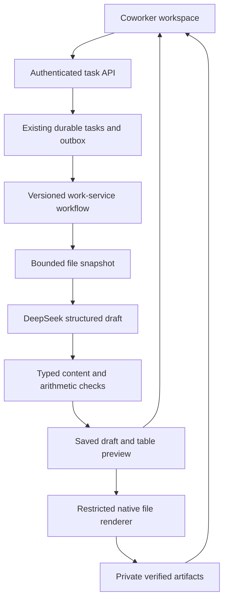

# Part 3, wave B: presentations, spreadsheets, and file snapshots

This wave extends the existing repository after merged PR #103. It adds editable PPTX/XLSX output and bounded CSV/XLSX/PPTX intake. The free writing editor and eight existing coworker services remain available under their existing controls. This is an implementation for a staged release; live DeepSeek quality, deployment, and capacity gates still apply.

## Delivered scope

| Service | Output | Current limits |
| --- | --- | --- |
| Presentations (`presentation`) | Native editable PPTX text and bar/line charts; speaker notes; PDF reading handout; TXT content/notes | 1–8 slides; cover, content, or chart layouts; up to three short points per content slide; source-grounded numeric charts |
| Spreadsheets (`spreadsheet`) | Native XLSX input cells, formulas, summary calculations and optional chart; CSV data values; PDF table | One worksheet; 1–40 rows; up to 8 input columns, 3 calculated columns, and 10 total columns |

Each also produces `source-manifest.json`, without source text. It identifies sources and missing information. Source labels appear beside the preview, not as internal IDs inside the user's presentation or table. Files require owner-authorized downloads.

Presentations are editable text/data layouts, not image generation or a design-preserving conversion of an uploaded deck. The PDF is a handout of the same content, not a pixel-identical slide export. Spreadsheet CSV files contain input and calculated row values; formulas, summary rows, charts, and formatting are in the XLSX. Formula-looking text in CSV is prefixed with an apostrophe so spreadsheet apps do not execute it.

## Architecture



There is one bounded model draft operation, with the existing retry/token/deadline controls. No extra planner model or open-ended agent loop is added. Models provide content and allowed calculation descriptors; application code creates formulas and Office files. Formula operations are sum, difference, product and ratio, referencing earlier numeric columns only. Arbitrary formulas, VBA, shell commands and model-generated tools are outside this contract.

The shared arithmetic module computes preview/PDF/CSV values and explicit XLSX formula caches. Missing inputs and undefined division stay blank; they never become a fabricated zero or a partial total. A summary stays blank if any required input is missing. Chart creation requires known categories and series values. Display formats round numbers for readability; the workbook retains the underlying numbers. Spreadsheet applications may differ in how edited blank cells appear in charts.

An empty formula result is marked as an OOXML string cache, distinct from a formula whose numeric result has never been saved. Incoming workbooks are not recalculated. Their saved values can be stale; extraction explicitly records this limitation and includes number formats for numeric cells. Missing caches and error cells produce an actionable error.

The draft, provenance and computed table are checkpointed before export. A restart after that checkpoint reuses the draft. The same `WorkServicesWorkflow` handles `work_presentation_v1` and `work_spreadsheet_v1`. No database migration, new infrastructure service, or queue is required. Parsing/rendering still happen outside the HTTP process, in resource-limited child processes with no provider, storage or identity secrets.

## File intake

| Type | Readable content | Bounds and limitations |
| --- | --- | --- |
| CSV | UTF-8 comma-separated cells, including quoted multilingual text | 200 data rows plus one header; 20 columns; consistent row widths |
| XLSX | Saved cell values and numeric formats; date/time values as ISO strings | Up to 4 worksheets, 200 data rows plus one header and 20 columns per sheet; no recalculation, chart/image interpretation, or visibility filtering |
| PPTX | Ordered slide text, table text, notes, and saved chart data | Up to 20 slides; no OCR, diagram interpretation, master-layout reconstruction or embedded-workbook execution |
| Existing formats | TXT, DOCX text and text-based PDF | Existing limits continue to apply |

The existing 8 MB upload and 20,000-character source limits also apply. Archive expansion is bounded to 32 MB/2,000 entries with 8 MB XML parts. Duplicate entries, traversal paths, XML entities, macros, active objects, encryption and external spreadsheet connections are rejected. Native PPTX chart workbooks and printer settings can remain in the package but are never opened or executed. External hyperlinks are not fetched. Parsing failures are shown to the user; oversized files are not silently truncated.

An uploaded table can be larger than the output-table limit: the user can request a summary or a specific selection. The model is instructed to request a smaller selection when necessary and not silently discard rows. Output grounding and arithmetic selection still require language/model quality evaluation; schemas cannot prove factual correctness.

## Rollout

New setting in `.env.coworker.example`:

```dotenv
SHUDDHO_ARTIFACT_SERVICES_ENABLED=false
```

This gate is independent of `SHUDDHO_WORK_SERVICES_ENABLED`. It controls new presentation/spreadsheet tasks and new CSV/XLSX/PPTX uploads. The authenticated catalog exposes available services and upload formats. Existing accepted tasks, idempotent replays, downloads and input files remain usable after the flag is disabled.

1. Upgrade **all API replicas, workers and dispatchers** with the `coworker` extras installed. Older workers sharing the queue do not understand these service versions. Leave both existing and new flags at their intended values during deployment.
2. Use the coworker Docker image, which already installs Noto fonts, including Bengali/Arabic and CJK coverage. The new Python dependencies are locked; LibreOffice is only a CI verification dependency.
3. On staging, enable the artifact flag and test paid DeepSeek requests for both services in English, Bangla and Arabic. Include exact slide counts, user-provided figures, missing amounts, and a saved-values file. Confirm model output fits the existing 4,096-token output budget and validate latency/cost before increasing limits.
4. Inspect the actual downloads in the customer apps you support (PowerPoint/Excel and browser viewers). CI uses LibreOffice; that does not establish identical Microsoft Office or Google rendering.
5. Verify upload rejection, account separation, interruption/restart, mobile scrolling and rollback. Disable the flag to stop new work if errors increase; retain compatible workers until accepted tasks finish.

No production deployment, paid model request, pricing change, external send/publish action or scale claim is implied by merging this wave.

## Implementation map and verification

| Files | Responsibility |
| --- | --- |
| `services/coworker/skills.py`, `schemas.py` | Service IDs/versions, bounded structured drafts and references |
| `services/coworker/calculations.py` | Decimal arithmetic and allowlisted Excel formulas |
| `services/coworker/office_sources.py` | Bounded CSV and Office snapshots |
| `services/coworker/office_exports.py` | Native slides, notes, charts, formulas, CSV/PDF output |
| `api.py`, `repository.py`, `runner.py`, `render_worker.py` | Gates, catalog, checkpoints and existing worker integration |
| `apps/web-editor/src/coworker/` | Service selection, previews, dynamic file chooser and downloads |
| `tests/test_coworker_office.py` | Contracts, arithmetic, owned artifacts, upload hazards and rollback |
| `tests/verify_office_native.py` | Native Office rendering and independent formula recalculation after edits |

```bash
uv sync --frozen --group dev --extra coworker
.venv/bin/python -m pytest tests/test_coworker.py tests/test_coworker_services.py tests/test_coworker_office.py -q
npm test
npm run build
# CI also runs PostgreSQL races, Temporal recovery, and the ten-service browser fixture.
# With LibreOffice, Noto fonts and pdftoppm installed:
PYTHONPATH=.:tests .venv/bin/python tests/verify_office_native.py /tmp/shuddho-office-qa
```

Native QA renders English, Bangla and Arabic workbooks/decks plus a dense Chinese deck. It edits spreadsheet inputs, recalculates them in LibreOffice, checks known totals, missing/zero/negative cases, and confirms formulas and live chart references survive. Rendered pages and browser screenshots are CI artifacts for visual review. Fixtures are deterministic test data, not production fallback responses or a multilingual quality benchmark.

Reference choices: [python-pptx speaker notes](https://python-pptx.readthedocs.io/en/latest/user/notes.html), [XlsxWriter formula caches and recalculation](https://xlsxwriter.readthedocs.io/working_with_formulas.html), [openpyxl loading options](https://openpyxl.readthedocs.io/en/stable/tutorial.html). The bounded contracts and rollout policy are Shuddho design decisions.

Next planned wave: cited web research, followed by approved external actions. These remain separate from the presentation/spreadsheet release gates.
