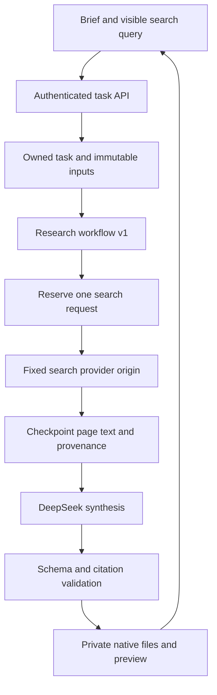

# Part 3, wave C: cited web research

Shuddho now has a `research` service in the existing coworker workspace. It searches one explicit public query, gathers up to five readable pages, and uses DeepSeek to prepare a report in the requested language. Findings include inspectable evidence and source links. The user can download DOCX, PDF, TXT and a provenance manifest.

The implementation is behind `SHUDDHO_RESEARCH_SERVICES_ENABLED=false`. It is not a production deployment, an independent fact-checking guarantee, or evidence of universal language quality. The free writing assistant and existing coworker services retain their workflows.

## Decisions and scope

| Kind | Statement |
| --- | --- |
| User decision | Continue Shuddho in the same repository; DeepSeek is the backend LLM. |
| Plan | Wave C adds research, comparisons and travel research before external actions. |
| Implementation choice | An optional Tavily adapter supplies search and provider-retrieved page text. This is a replaceable `ResearchProvider` boundary, not a change to the LLM provider. |
| Bound | One search request per task, five results, 3,000 retained characters per page, 40-second total search timeout, 2 MiB decoded response limit. |
| Existing limits | Up to 20,000 characters of notes/brief/files, account task/concurrency limits, model token reservations, two model attempts, task deadline and private artifact storage still apply. Research may add up to 15,000 source characters; the conservative token reservation can reject especially large combined multilingual input. |
| Deferred | Query-planning loops, direct URL browsing, authenticated websites, exhaustive literature reviews, live booking/availability guarantees, sending, publishing and calendar changes. |

Comparisons and travel questions use the same Research service. A result is research, not a booking, visa determination, purchase, or scheduled itinerary. Notes and files can supply context, but cannot masquerade as independently retrieved web evidence.

## Workflow



Research has a separate Temporal workflow/activity identity, `shuddho_research_v1` / `shuddho_research_phase_v1`. Existing report-and-email and work-service histories remain four-step workflows. Research adds a checkpointed step between extraction and drafting. A task routed to the wrong workflow is rejected before spending.

No new database migration is required. The existing `cw_steps` table stores immutable `research_input`, one `search_attempt` ledger, and the `research` evidence checkpoint. These are committed/read through the same owned task boundary; users cannot supply step names or write checkpoints.

## Request and user experience

```json
{
  "skill_id": "research",
  "instruction": "Compare the options and explain the trade-offs with cited evidence.",
  "notes": "My private preferences, if useful.",
  "document_ids": [],
  "output_language": "bn",
  "research": {
    "query": "public transport options in Dhaka",
    "time_range": "any"
  }
}
```

Submit through the existing authenticated `POST /api/v1/tasks` with an idempotency key. Research options are accepted only for `research` tasks. The query is 3–400 characters; date ranges are `any`, `day`, `week`, `month`, or `year`. Changed queries/date ranges require a new idempotency key. Unchanged accepted requests still replay after the feature flag is disabled. Earlier services keep byte-compatible request fingerprints.

Only the visible query goes to Tavily. The app never automatically turns the brief, notes, file text, model output or webpage instructions into additional search requests. The form explains this before submission. The private context and retrieved evidence go to the configured DeepSeek service for synthesis under the existing model boundary.

The UI shows the search phase, expandable evidence under each finding, source links, retrieval dates, estimated source dates and omitted-result counts. Revising a saved task restores the original query and date range after refresh. Links use a separate tab with no referrer; account tokens never accompany them. Research follows the existing responsive layout and owned download flow.

## Evidence and recency

- The adapter requests raw page text. Search snippets and a provider-generated answer are never substituted for a retrieved page. Duplicate URLs, unsafe link forms, empty/very short pages, and date-range mismatches are excluded. No usable pages produces `research_no_evidence` before a model call.
- Each source has a server-assigned `web-1`…`web-5` ID, validated public HTTP(S) URL, title, retrieval timestamp, nullable estimated publication/update date, provider, retained-text SHA-256, and truncation marker. A retrieval timestamp does not establish freshness.
- A date range requests the provider's date filter and excludes undated results. The server also excludes estimated dates older than 1/7/31/366 days respectively and implausible future dates. Those month/year bounds are approximate; the provider applies its own calendar semantics. An unfiltered search may retain older/undated pages, visibly labeled as such.
- Every finding has at least one citation. The model returns source IDs and short verbatim excerpts, never citation URLs. The server checks that each excerpt occurs in the actual retained page text after Unicode/whitespace normalization. Citations to notes, invented IDs, fabricated or translated quotes, and quotes outside the retained excerpt fail validation. Total unique quoted text is capped at 400 characters per source.
- Citations establish traceability, not truth or semantic entailment. A genuine quote can still be misinterpreted, and the provider's raw text is not an independently authenticated copy. Evaluate relevance, attribution, date handling, conflicting claims and source quality with real outputs before release. Primary sources are preferred in model guidance but are not guaranteed by search ranking.
- Missing evidence should produce `missing_information`, with unsupported findings omitted. A report containing only evidence gaps is marked `needs_input`. No search outage falls back to an uncited model answer.

Full retained webpage text is removed from checkpoints when a task completes, fails or is cancelled. Short cited excerpts, source metadata, hashes, original user input and drafts remain with the task. Existing account/task deletion and retention operations still require the Part 2 release work.

## Network, permissions and cost

The worker only calls `https://api.tavily.com/search`; it does not fetch a result URL or expose an arbitrary proxy. Redirect following and environment proxy discovery are disabled. The result URL validator excludes credential-bearing URLs, literal IPs, local hostnames, nonstandard ports, script/file schemes and control characters. This link validation is not a DNS-based SSRF defense; the fixed request destination and absence of arbitrary fetching are the boundary. Deployment egress should permit only the selected service origins and required infrastructure.

Search parameters are server-owned: basic depth, no auto-parameter upgrades, no generated answer, no images, at most five results. One credit is conservatively reserved in the task ledger; reported credits replace the reservation when known. Account daily task limits also bound newly accepted research tasks. Configure provider account spending limits and usage alerts before rollout; this code does not create a global search-spend controller or a billing system.

A saved evidence checkpoint is reused across model retries and worker replacement. If a worker disappears after the paid request was reserved but before its result was saved, the task fails with `search_outcome_unknown`; it never automatically repeats the search. The reservation stays accounted. A deliberate new task can search again and may incur another charge. This trades automatic retry availability for a strict per-task paid-call bound.

Cancellation stops new work and cancels the local in-flight request. It cannot guarantee that a provider stopped billing an already accepted request. Provider response bodies, keys and private query text are excluded from user-facing failures and Temporal history. Retrieved content cannot choose tools, accounts, destinations or permissions; there is no action tool available in this workflow.

## Files and release procedure

| Files | Responsibility |
| --- | --- |
| `services/coworker/research.py` | Fixed-origin provider adapter, bounds, source records, dates and evidence validation |
| `schemas.py`, `skills.py`, `drafting.py` | Explicit research input, typed report and constrained model instructions |
| `repository.py`, `runner.py`, `workflow.py`, `worker.py` | Immutable options, search ledger, checkpoints, routing and recovery |
| `work_exports.py` | Cited DOCX/PDF/TXT with native source hyperlinks |
| `apps/web-editor/src/coworker/` | Research form, source/evidence preview, task restoration and safe links |
| `tests/test_coworker_research.py`, `test_coworker_postgres.py`, `test_coworker_temporal.py` | Evidence validation, network boundary, quotas, atomic reservation, recovery/cancellation |
| `tests/verify_research_exports.py`, `apps/web-editor/test/coworker-browser.mjs` | Multilingual export previews and browser verification |

Backend settings added to `.env.coworker.example`:

```dotenv
SHUDDHO_RESEARCH_SERVICES_ENABLED=false
SHUDDHO_SEARCH_PROVIDER=tavily
TAVILY_API_KEY=
```

1. Complete the existing [Part 2 staging gates](PART_2_COWORKER_FOUNDATION.md#production-staging-and-rollback). This wave does not provision identity, database, object storage or Temporal.
2. Keep the research flag false. Deploy matching API, dispatcher and worker code to every instance on the queue before enabling the new service. An older dispatcher cannot recognize its workflow version. Existing features retain their independent flags.
3. Configure a backend-only Tavily key on API/worker instances, retain DeepSeek credentials, and verify provider access, data-processing terms/retention, permitted use, request limits, spending limits and operational ownership. A flagged-on service with missing/unsupported search configuration fails startup. Tavily remains an implementation choice to assess in staging, not an irrevocable production commitment.
4. In staging, make a budgeted real search + DeepSeek request. Check source URLs/text, provider credit accounting, ownership, downloads, date filters, no-results handling, cancellation, provider failure, worker loss and unchanged legacy tasks. Confirm the app never fetches result URLs or sends private notes to search.
5. Evaluate real English, Bangla and Arabic outputs and actual deployment fonts. Check citation entailment, misleading source text, unsupported comparisons, old/undated prices, travel information and insufficient evidence. CI uses explicitly simulated search/model responses; it proves mechanics, not live provider compatibility or factual quality.
6. Enable for a small staging cohort, measure latency, cost, exclusions, failures, queue age and usefulness, then decide production rollout separately. No flag is enabled by this change.

Rollback: disable `SHUDDHO_RESEARCH_SERVICES_ENABLED` to stop new research submissions. Keep current workers and credentials to drain already accepted tasks. Saved research tasks, citations, artifacts and idempotent replay remain accessible. Do not roll back code to a version unable to recognize `work_research_v1` while those tasks exist.

## Verification notes

The tests cover the authenticated catalog, cross-account denials, legacy idempotency compatibility, bounded/sanitized search failures, explicit-query privacy, raw-page-only evidence, recency exclusions, real native hyperlinks, model usage on invalid evidence, checkpoint recovery, and search reservation races. Export review files include English/Bangla/Arabic reports with long findings and five links. The browser suite exercises eleven services including source evidence, query restoration, downloads and mobile layout.

Live Tavily/DeepSeek calls, deployed infrastructure, semantic multilingual evaluation and production rollout remain release gates. The next planned service wave is approved external actions; it requires OAuth, exact-payload approval, idempotent execution and provider receipts.

## Primary references

- [Tavily Search API](https://docs.tavily.com/documentation/api-reference/endpoint/search): the adapter's request/response contract, raw-content option, date estimates and usage fields. The adapter must be rechecked if this contract changes.
- [OWASP SSRF prevention guidance](https://cheatsheetseries.owasp.org/cheatsheets/Server_Side_Request_Forgery_Prevention_Cheat_Sheet.html): fixed destinations, redirect control and the distinction between validating a URL and safely fetching it.
- [Temporal Python workflow versioning](https://docs.temporal.io/develop/python/workflows/versioning): existing histories remain on their original definitions; research uses a new workflow identity with a coordinated rollout.

All capacity, rollout and boundary choices above are Shuddho implementation decisions, not claims made by these sources.
