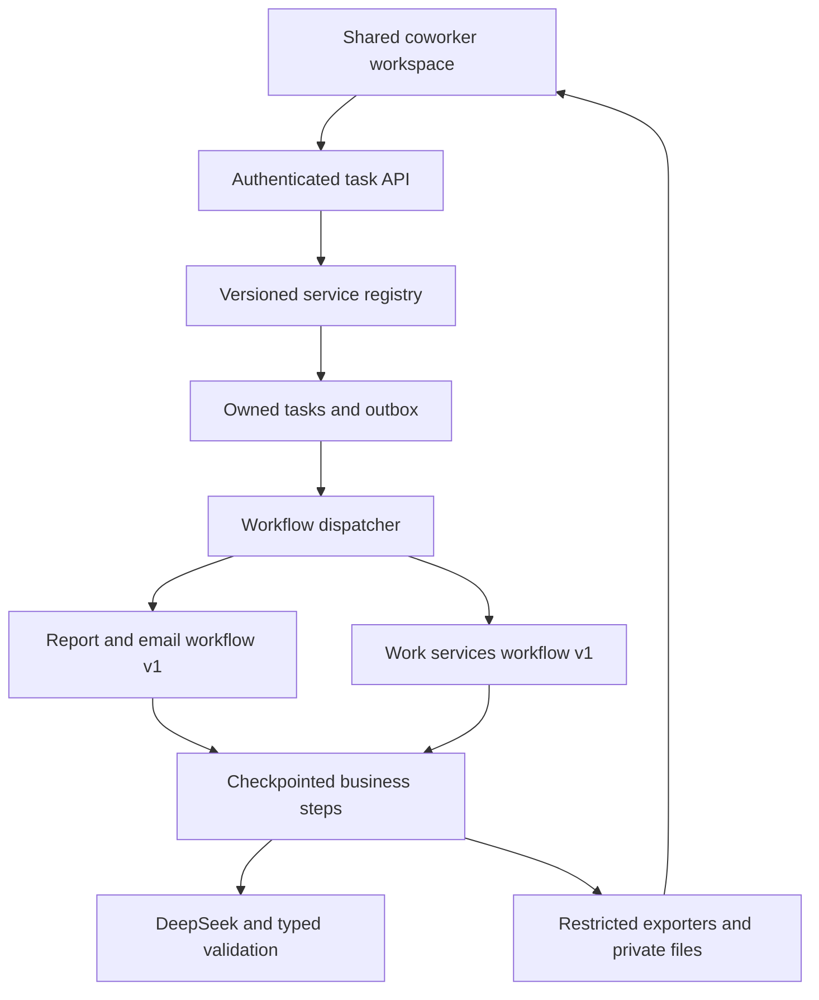

# Part 3, wave A: everyday and professional work services

This implementation continues from merged Parts 1 and 2 in the same repository. It adds the first Part 3 service wave. The remaining presentation, spreadsheet, research, external-action and operations waves are still pending. This is code for a staged release, not evidence of a production rollout or universal language quality.

## Available work

| Service ID | User outcome | Output files |
| --- | --- | --- |
| `report_email` | Existing report and accompanying email draft | `report.docx`, `report.pdf`, `email-draft.txt` |
| `email` | Email, reply, follow-up or introduction draft | `email-draft.docx`, `.pdf`, `.txt` |
| `document` | Letter, application, memo, proposal, SOP or other requested document | `document.docx`, `.pdf`, `.txt` |
| `career` | CV/resume, cover letter, bio or interview preparation | `career-document.docx`, `.pdf`, `.txt` |
| `social` | One to six Facebook/LinkedIn/other post drafts | `social-posts.docx`, `.pdf`, `.txt` |
| `meeting` | Agenda/minutes, supported decisions, and recorded or suggested actions | `meeting-notes.docx`, `.pdf`, `.txt` |
| `daily_plan` | Proposed daily/weekly routine, priorities and checklist | `daily-plan.docx`, `.pdf`, `.txt` |
| `personal_plan` | Household, event, shopping or travel outline from supplied facts | `personal-plan.docx`, `.pdf`, `.txt` |

Every task also produces `source-manifest.json`. For new services it includes the service ID, source hashes, language and missing details. Source text is not included. Provenance appears alongside previews and in the manifest; UUID references are not inserted into a ready-to-use CV, letter or social post.

Each task creates one requested package. For example, ask for a CV or a cover letter within Career; it does not automatically create every career document. Six posts is a per-task limit, not a claim that a monthly content calendar has been scheduled.

## User experience

The user selects a work service, describes the desired result, adds optional notes/files, and chooses an output language. A complete brief is sufficient for the new services; the user does not need to copy the same facts into a second field. Existing report-and-email requests retain their notes/file requirement.

The service selector comes from the authenticated server catalog. It changes an untouched preset instruction but preserves a customized brief. Saved tasks display their service in history. Revising a task restores its original service and input, including after refresh. Email, document and post previews provide copy controls, while all services provide owned downloads.

Meeting actions carry `recorded` or `suggested` status. Unknown owners/deadlines remain null. Plans carry `provided` or `suggested` status with descriptive time labels. These drafts do not create reminders, calendar events, bookings, sent emails or published posts. Current prices, availability and web research require a later tool integration.

## Architecture and compatibility



Routing uses an explicit server-owned service ID. No extra model call is needed to select a service. The normal path uses one completion, with the existing bounded retry/token policy for failures. Service instructions, output types and filenames are code-controlled; a model cannot select tools, write paths, accounts or workflow names.

The existing `cw_tasks.workflow_version` column stores `report_email_v1` or `work_<service>_v1`, so this wave requires no new database migration. Task IDs, ownership, quotas, model reservations, deadlines, outbox delivery, cancellation and source versions remain shared. Account budgets apply across services, not once per service.

Part 2 request fingerprints remain byte-compatible: `skill_id=report_email` is excluded from the canonical hash. Replaying an old request returns its original task. Changing the service under the same idempotency key produces a conflict. An unchanged accepted task may still be retrieved/replayed after disabling new submissions.

The original Temporal workflow definition is retained. New services have a separate workflow and activity identity. Workers reject a task sent to the wrong workflow before making a model call. Both workflows share the existing four-activity concurrency cap. There are no independent autonomous agents or extra worker pools per service.

The server validates the selected output model, language code, source IDs, bounded strings/lists and exportable characters. Output is validated again before saving and rendering. Only known filenames leave the rendering subprocess. New document exports use actual Word bullet styles, escaped PDF markup, language attributes and RTL shaping. Labels in meeting/plan files come from the requested-language output rather than English-only template headings.

For new services the brief is a source named `brief`. It joins optional notes and up to five files, so a draft may cite up to seven source IDs. The brief counts toward the existing 20,000-character combined source limit. Existing report-and-email tasks keep their original extraction behavior.

## API changes

`GET /api/v1/skills` requires a valid account token and returns enabled service IDs, names, descriptions, default instructions and advertised output formats. Internal model guidance is not returned.

```json
{
  "skill_id": "email",
  "instruction": "Draft an email to my team saying we completed 12 reviews today.",
  "notes": "",
  "document_ids": [],
  "output_language": "bn"
}
```

Submit this to `POST /api/v1/tasks` with the existing bearer token and `Idempotency-Key`. The response now includes `skill_id` and `workflow_version`. Old clients may omit `skill_id`; the default remains `report_email`. The web client omits that default field when using the original service so it can still talk to a Part 2 API. A missing catalog endpoint falls back only to the original service; authentication/network failures are surfaced.

New draft shapes use `kind`: `email`, `document` (also Career), `social`, `meeting`, or `plan`. Part 2's `report` + `email` shape remains supported for saved tasks. See `services/coworker/schemas.py` for exact schemas and limits.

## Exact implementation files

| Files | Responsibility |
| --- | --- |
| `services/coworker/skills.py` | Allowed IDs, stable versions, service instructions and public catalog |
| `schemas.py`, `drafting.py`, `runner.py` | Per-service typed output, provider validation, input provenance, checkpoint recovery |
| `work_exports.py`, `exports.py`, `render_worker.py` | Native DOCX/PDF/TXT layouts and output whitelist |
| `repository.py`, `api.py`, `config.py` | Catalog, feature flag, version persistence and compatible idempotency |
| `workflow.py`, `worker.py` | Separate work-service execution identity and entry validation |
| `apps/web-editor/src/coworker/client.ts`, `CoworkerWorkspace.tsx`, `DraftPreview.tsx`, `workspace.css` | Service selection, revision, tailored previews and copy/download controls |
| `tests/test_coworker_services.py`, `tests/test_coworker_temporal.py` | Service contracts, artifacts, rollback, ownership, and worker recovery |
| `tests/coworker_samples.py`, `tests/coworker_browser_server.py`, `apps/web-editor/test/coworker-browser.mjs` | Explicitly simulated model fixtures and full browser verification |

## Staged release

1. Complete the existing [Part 2 staging requirements](PART_2_COWORKER_FOUNDATION.md#production-staging-and-rollback), including real identity, database, private storage, Temporal, provider credentials and image startup.
2. Keep `SHUDDHO_WORK_SERVICES_ENABLED=false` during the code rollout. Upgrade **every API and worker/dispatcher instance** before enabling it. Retire all Part 2-only dispatchers: they do not understand the new workflow versions. Workers on the same task queue must have matching workflow/activity registrations. This prototype uses a coordinated feature-flag rollout; it does not implement Temporal deployment versioning.
3. Verify a queued legacy task completes with the new worker, then verify all seven new services in a staging deployment with `SHUDDHO_WORK_SERVICES_ENABLED=true`. The existing `SHUDDHO_COWORKER_ENABLED` and `VITE_COWORKER_ENABLED` flags must also be enabled for that deployment.
4. Test one instruction-only request, each file type, an incomplete brief, a provider outage, cancellation and a worker replacement. Check account isolation and real private downloads. Measure latency, queue age and actual token use.
5. Use a small approved cohort. Evaluate real DeepSeek outputs against supplied facts in the required languages before expanding access. CI fixtures prove application behavior, not model accuracy.

To stop new service submissions, set `SHUDDHO_WORK_SERVICES_ENABLED=false` and restart the API instances. Keep the Part 3 worker code available to drain active tasks. Saved tasks and files remain accessible. Do not roll back worker/API code to Part 2 while Part 3 task rows or active histories need it.

## Verification and next waves

Automated checks cover native output for all new services, English/Bangla/Arabic file structures, unknown service IDs, disabled services, legacy replay, bad source references, missing details, token accounting, owned artifacts, and no repeated completion after checkpoint recovery. The browser fixture covers all eight services, service-aware revision after refresh, copy-post behavior, downloads, mobile layouts and account switching. Identity responses and model text are simulated; signature checks, task persistence, Temporal and rendering are real.

Before release, record for each service/language: source fidelity, missing-information handling, usable formatting, task completion, latency and token cost. Include at least one realistic long CV, a multi-page official document, mixed-script text, and RTL output. Human assessment is required for semantic quality; declaring the requested language code does not prove the text is in that language.

Later Part 3 waves remain: editable PPTX/XLSX and broader file transformations; cited web research; approved email/calendar/social actions with receipts; then measured capacity, cleanup/retention, backup restoration, monitoring and regional expansion. Existing Part 2 retention and operations gaps still apply. No pricing, benchmark or billion-user capacity claim changes in this wave.

The structured-output boundary follows [DeepSeek's JSON-mode guidance](https://api-docs.deepseek.com/guides/json_mode/); a JSON response still needs application validation. Deployment constraints follow [Temporal's task-queue registration rules](https://docs.temporal.io/task-queue) and [Python workflow versioning guidance](https://docs.temporal.io/develop/python/workflows/versioning).
